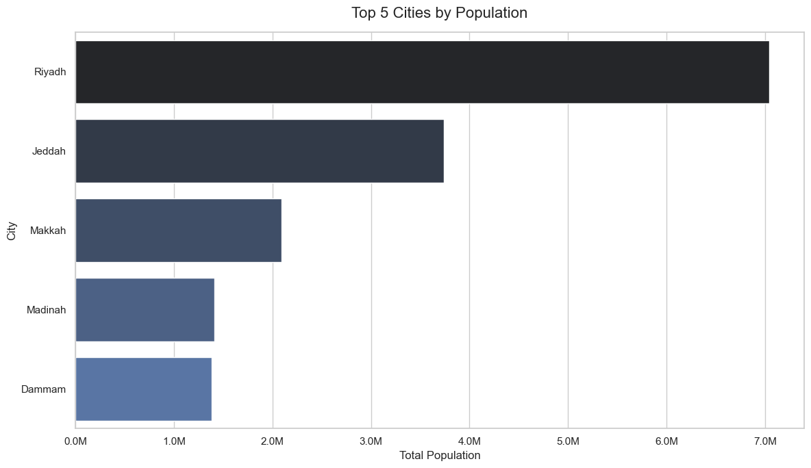
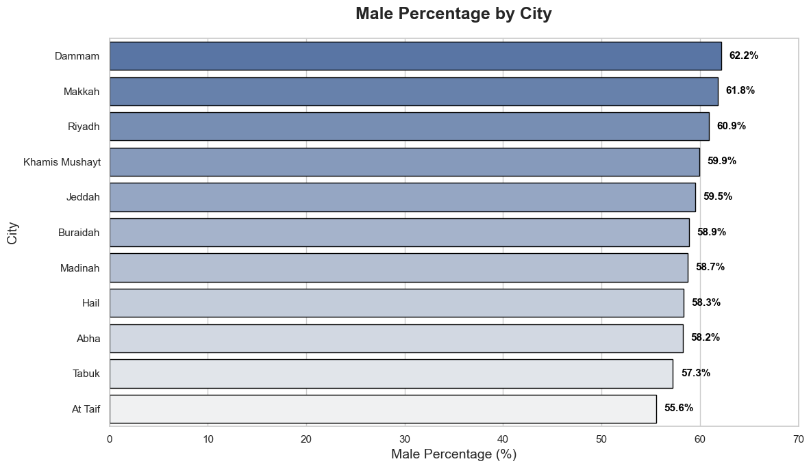
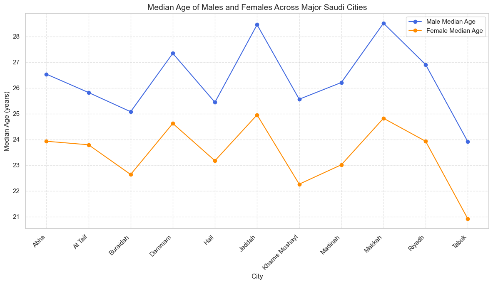
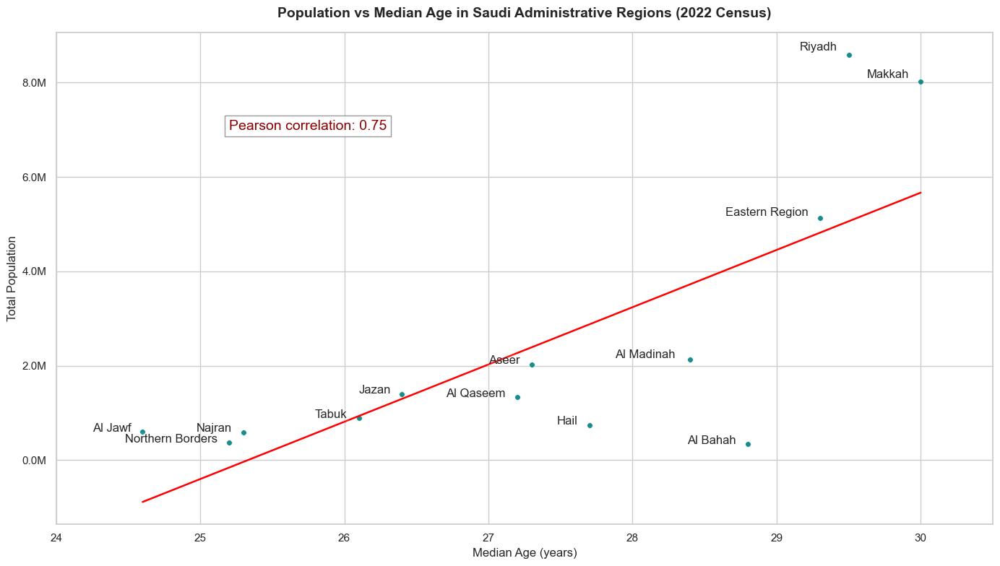
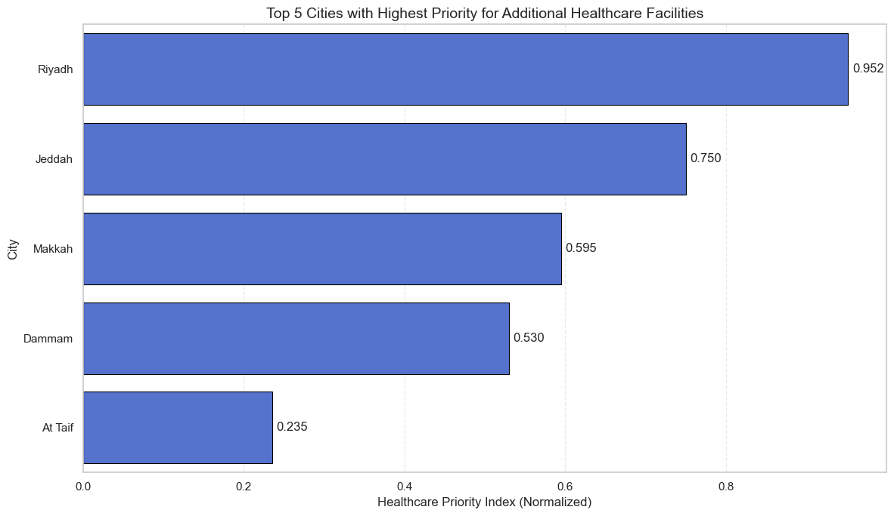

# Saudi Cities Demographics Analysis

## Overview

This project analyzes demographic data of major Saudi cities to uncover population distribution patterns, gender and age variations, and relationships between city size and median age, ultimately deriving a prioritized ranking for additional healthcare facility investments.

## About the dataset

The **Saudi Arabia Population Census Dataset** provides detailed demographic information about the population of Saudi Arabia. It includes variables such as total population, male and female population counts, and median age indicators.

The dataset is based on Saudi Census 2022 data conducted by GASTAT, ensuring that the underlying information originates from an official government census. The data is publicly available on Kaggle: [Dataset Link](https://www.kaggle.com/datasets/majedalhulayel/saudi-census-2022-population/data)

## The questions

1. Which cities have the largest population?
2. What is the male percentage in census areas located at city centers?
3. How does the median age of males and females vary across major Saudi cities?
4. Is there a relationship between city population size and median age in Saudi Arabia?
5. What are the top 5 Saudi cities with the highest estimated need for additional healthcare facilities based on population size and median age?

## Python Libraries Used

- **pandas**: Data manipulation and analysis
- **numpy**: Numerical operations
- **matplotlib**: Plotting and visualization
- **seaborn**: Statistical data visualization
- **shapely**: Geometric operations (Polygon)
- **ast**: Safe evaluation of strings containing Python literals

## The Analysis

Check out the project [here](Saudi_Arabia_Census_2022.ipynb)

### 1. Which cities have the largest population?

### Results

### Insight:

- Riyadh has the largest population by a wide margin, reinforcing its position as the main urban and economic center in Saudi Arabia.
- Jeddah ranks second, but there is a substantial population gap between it and Riyadh, indicating strong population concentration in the capital.
- Makkah, Madinah, and Dammam have relatively similar population sizes, suggesting a more balanced distribution among secondary cities.

### 2. What is the male percentage in census areas located at city centers?

### Results

### Insight:

- Dammam shows the highest male percentage, likely due to a large expatriate male workforce in industrial and commercial sectors.

- Major pilgrimage and urban centers like Makkah and Riyadh exhibit elevated male ratios, reflecting seasonal and temporary male labor migration patterns.

- Smaller, more family-oriented cities such as At Taif and Tabuk have lower male percentages, indicating more balanced gender distributions typical of local Saudi communities.

### 3. How does the median age of males and females vary across major Saudi cities?

### Results

### Insight:

- Males consistently have a higher median age than females across all major Saudi cities, suggesting that male populations (often including expatriate workers) tend to be older on average.
- Cities like Jeddah and Makkah show the largest gender gap in median age, likely due to a higher proportion of working-age male migrants in these commercial and pilgrimage hubs.
- Smaller or more family-oriented cities (such as Abha, At Taif, and Buraydah) exhibit smaller gender differences in median age, reflecting more balanced local Saudi family demographics with younger overall populations.

### 4. Is there a relationship between city population size and median age in Saudi Arabia?

### Results

### Insight:

- There is a strong positive correlation (Pearson 0.75) between total population and median age across Saudi administrative regions, indicating that larger regions tend to have slightly older median ages.
- The most populous regions, such as Riyadh and Makkah Al Mukarramah, exhibit the highest median ages, likely due to significant concentrations of working-age adults and expatriates in major urban and economic centers.
- Smaller and more rural regions, including Al Jawf, Northern Borders, and Najran, cluster at the lower end with both smaller populations and younger median ages, reflecting more traditional family structures and higher birth rates in less urbanized areas.

### 5. What are the top 5 Saudi cities with the highest estimated need for additional healthcare facilities based on population size and median age?

### Results

### Insight:

- Riyadh stands out with the highest priority for additional healthcare facilities, driven by its massive population and demographic demands.
- Jeddah ranks second, reflecting its status as a major commercial and pilgrimage hub requiring significant capacity expansion.
- Makkah, Dammam, and At Taif complete the top five, highlighting that these cities also face notable healthcare needs but at a lower relative level compared to Riyadh and Jeddah.

### Conclusion

This project deepened my understanding of Saudi cities' demographics .
The insights highlight how population size and median age can guide real-world decisions, such as prioritizing healthcare investments in high-need urban areas.
It serves as a strong foundation for future analyses and reinforces the power of data-driven approaches in addressing societal challenges.
Overall, the findings empower more informed planning and underscore the value of continuous learning in turning raw data into meaningful impact.
